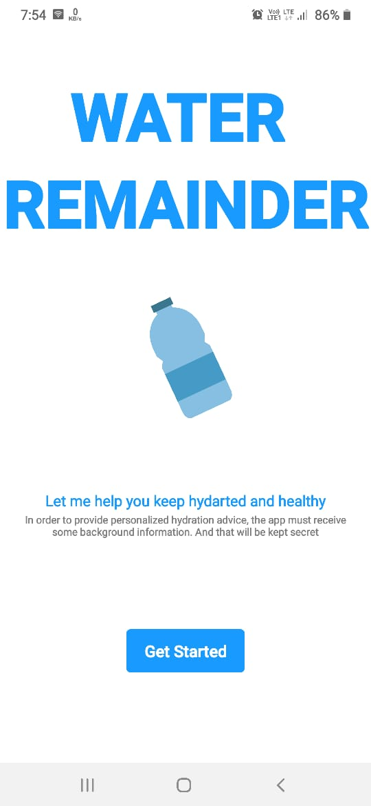
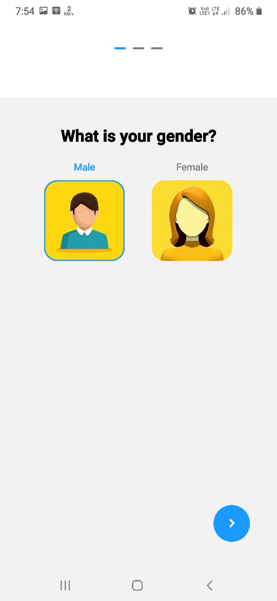
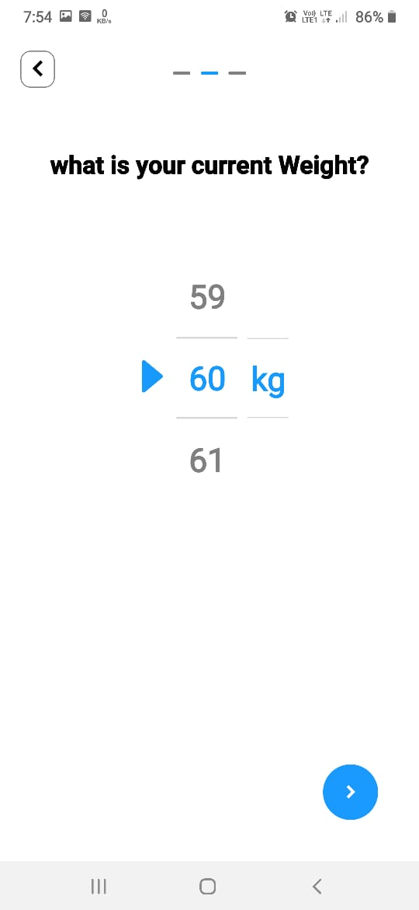
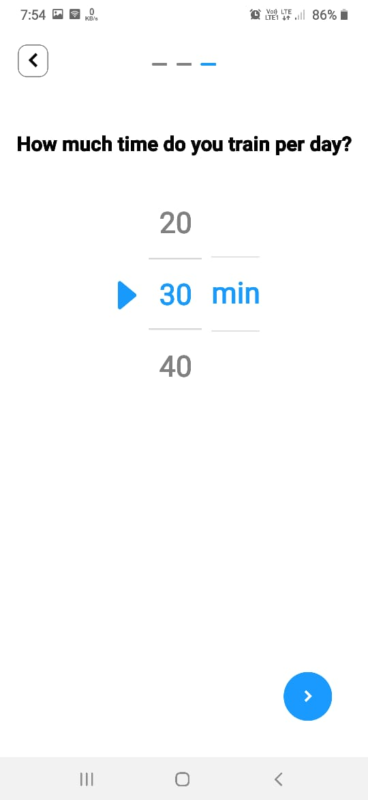
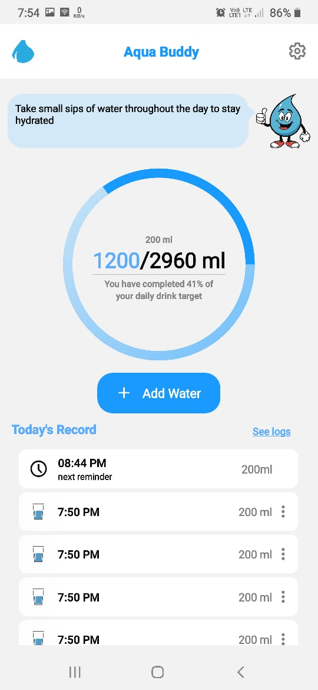
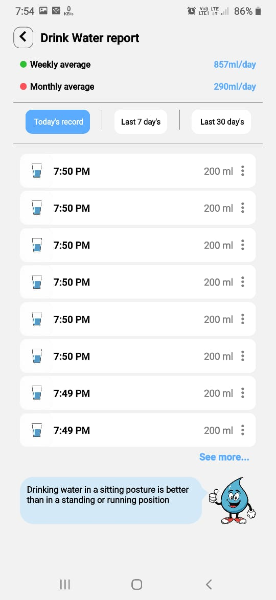
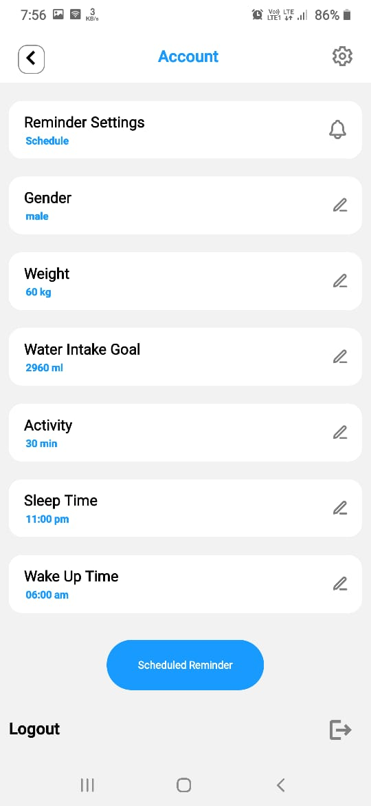
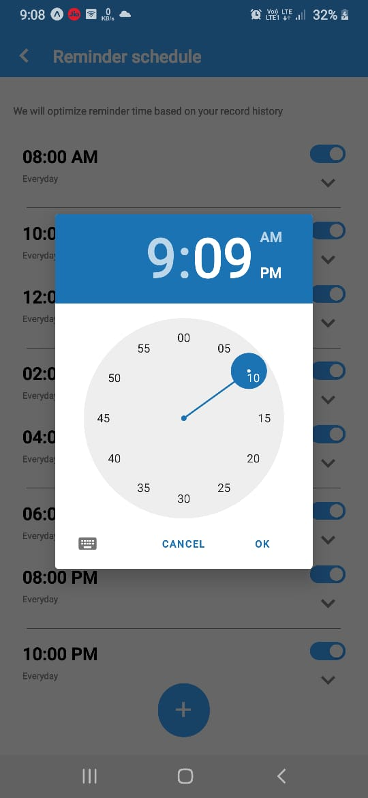
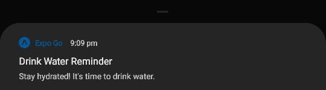
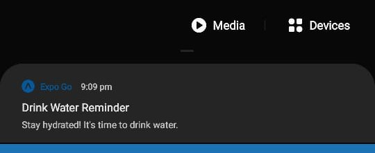

# Aqua Buddy

Aqua Buddy is a mobile application developed using Expo and React Native that helps users stay hydrated by sending them water intake reminders at regular intervals. With customizable reminder settings and a user-friendly interface.

## Getting Started

To get started with Aqua Buddy, follow these steps:

Clone the Repository:

```bash
git clone https://github.com/your-username/aqua-buddy.git
```

Install Dependencies:

```bash
cd aqua-buddy
npm install
```

Run the App:

```bash
npx expo start
```

Scan QR Code:

```bash
Open the Expo Go app on your mobile device and scan the QR code displayed in the terminal to launch the app.
```

## Technologies Used

**React Native**

**Expo**

**Redux**

## Screenshots














## 🔗 Contact me at

[](linkedin.com/in/kishan-talekar-2613b8260)
